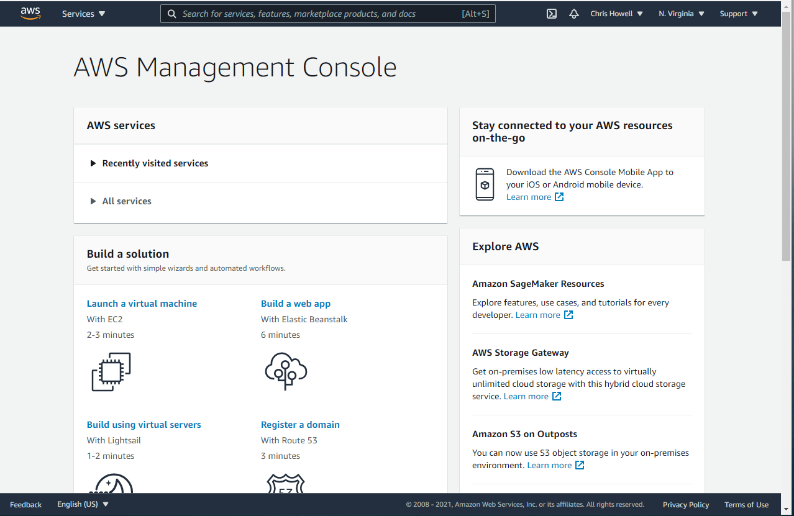
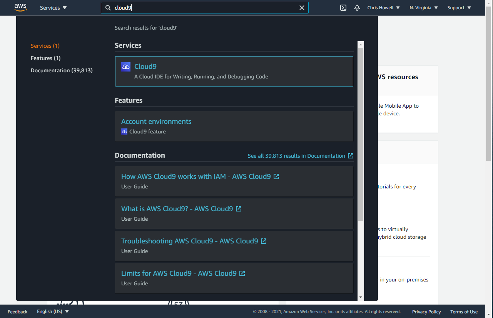
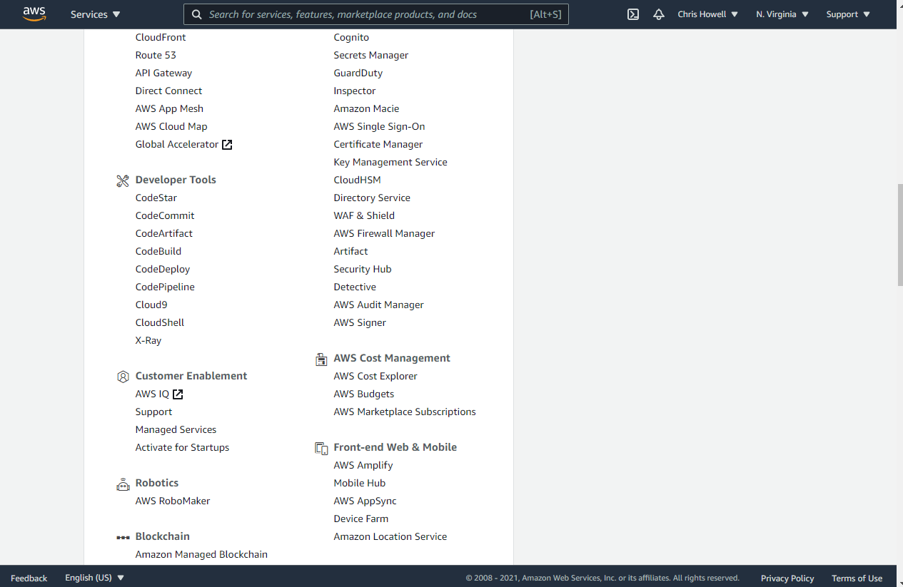
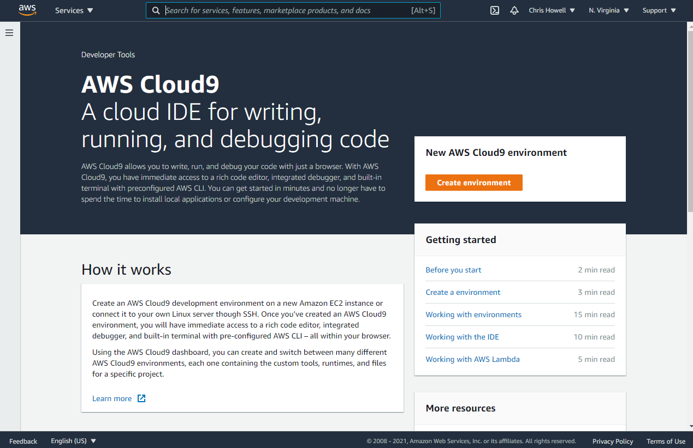
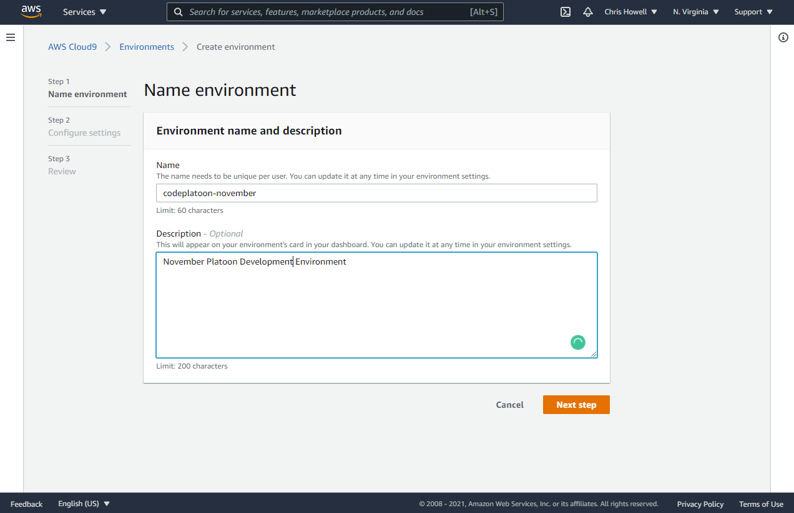
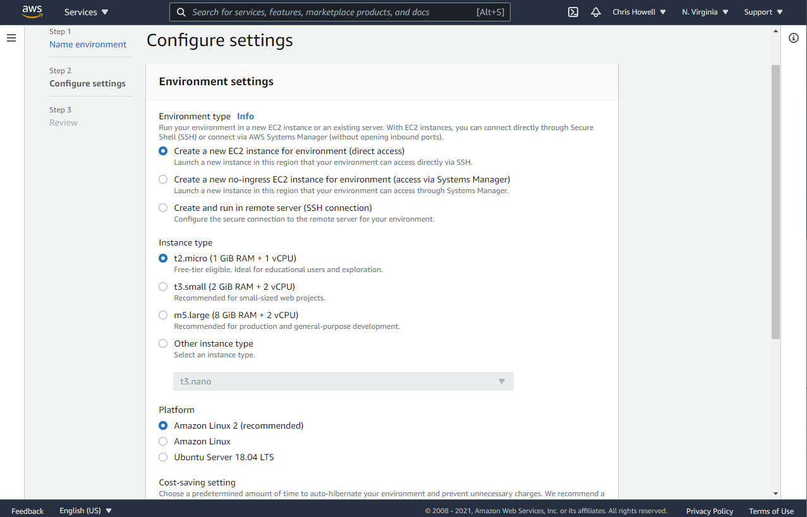
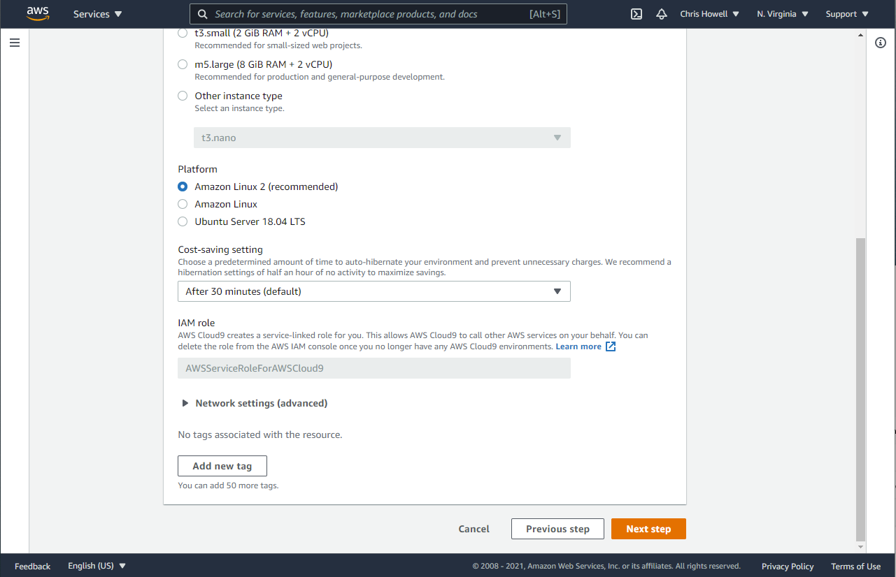
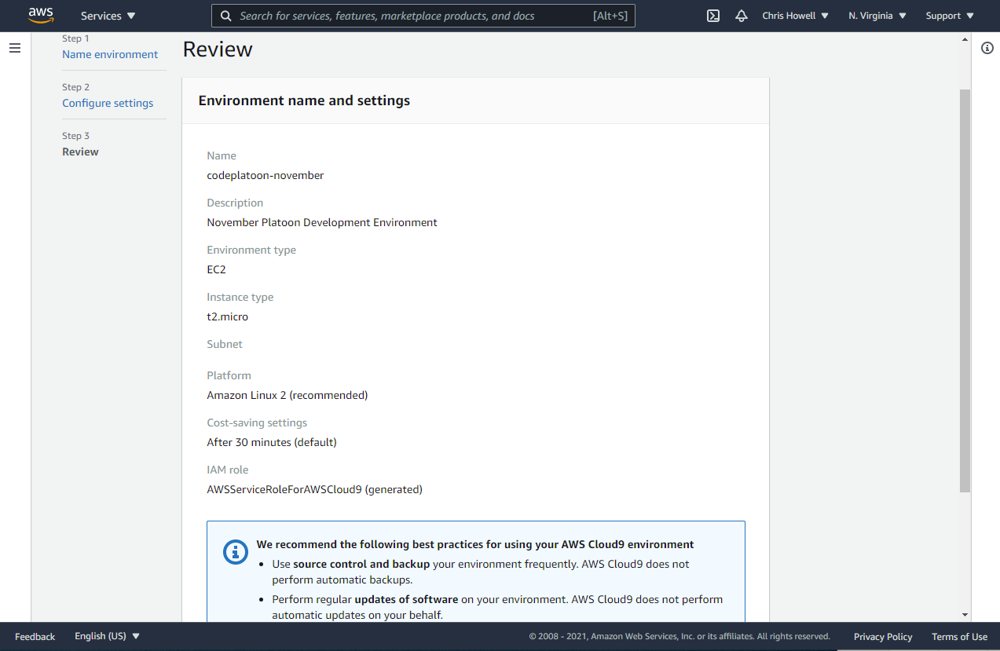
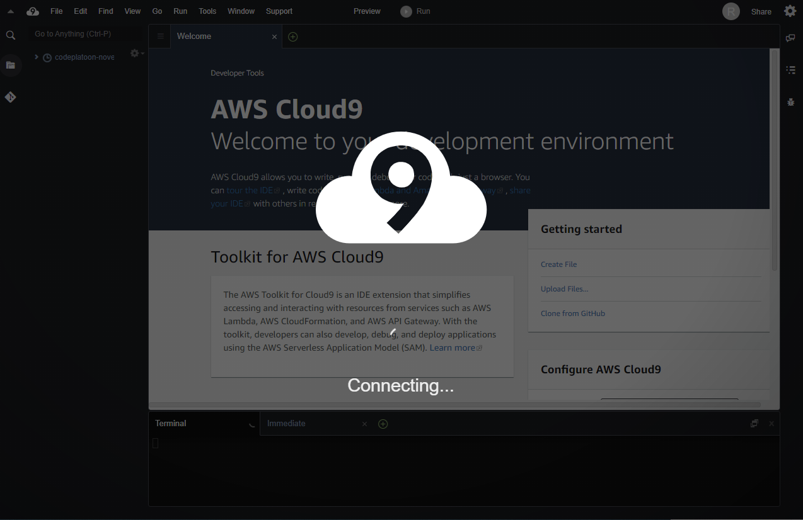
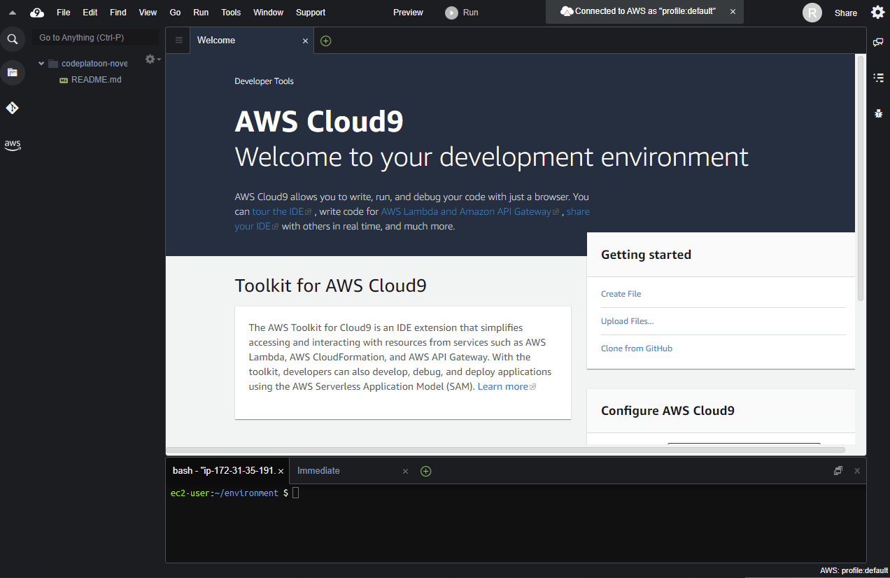

# AWS Cloud9 Instructions

For our students on Windows, we have a separate setup for you using AWS's Cloud9. Instead of going through virtualization, messing with Bios, and praying that things work, our IDE will be fully browser based with AWS's Cloud9. We estimate that your usage of AWS for Code Platoon will amount to around $20/month- you are responsible for the cost. To get started, please sign in or sign up for an [AWS Account](https://portal.aws.amazon.com/billing/signup#/start). 

1. After successfully creating your account or signing in you want to Sign in to the [AWS Console](https://aws.amazon.com/console/). This is your dashboard to access any of the AWS Services.

2. From here you can either use the search bar in the navigation or you can use the **All Services** listing to look for: `Cloud9`. In the search bar you can simply type: `cloud9` or you can use the **All Listings** dropdown looking for a **Development Tools** category which `Cloud9` will be nested within. Click on the name of the service: `Cloud9`.

Method 1: Use the Search by to find the Service in question.

Method 2: Use the All Services listing

3. You immediately see a page with a button that says **Create environment**. Click this button.

4. Fill out the two fields with the following:
- For the **Name** field: `codeplatoon-<cohort-name>` where `<cohort-name>` for example would be something like `mikeplatoon`
- For the **Description** field: `Development environment for the CodePlatoon curriculum`

5. For Environment settings, **DO NOT** change. Leave them as is - they should look like the settings in the image below.

6. Click the **Next Step** at the bottom leaving all the defaults in place.

> Ensure you leave **Cost-saving Settings** set to the (default) of 30 minutes. This is Amazon trying to help you protect your Cloud environment and put it to a sleeping state in case you forget to close or stop it from running. You wont be charged any money while your environment is not in use (running).

7. Review this page, ensure your settings look correct and match besides the **Name** and **Description** that should match with what you entered. If everything looks correct, click the **Create Environment** button at the bottom.

8. Our environment is now being setup and configured. This may take a few minutes to complete.

9. Once ready our Cloud Environment and IDE will look like this.

## Next Steps
We now have a base cloud IDE environment to work from, but we still need to prepare this base environment for all the things we are going to do during class. Much of this we have automated into something called a shell script. We need to get this shell script into our environment to be able to run it.

### The Installfest Script
Inside your running Cloud9 IDE Window

1. Create a file named `installfest.sh` using the sidebar or console.
   - Sidebar: You can "right click" -> Create New File
   - Alternatively, a console command: `touch installfest.sh`
2. Make this file executable using this command: `chmod +x installfest.sh`
3. In your sidebar click and open `installfest.sh`, you should see an empty file open in the editor view.
4. Go to [Cloud9-Setup Installfest Script](https://github.com/novemberplatoon/cloud9-setup/blob/main/installfest.sh). Find and Click the **Raw** button.
5. Highlight and **COPY** ALL the contents on this page. 
6. Open your Cloud9 IDE window where we should still have our `installfest.sh` file open in Editor view. **PASTE** ALL the contents you copied into this `installfest.sh` file and ensure you **SAVE** before continuing.

7. Run command: `./installfest.sh` (this will take a few minutes)

8. When the script finishes you should see `Installfest script finished running!` output to the screen as the very last line. If you do not see this message, reach out to a TA or Instructor.

9. Finally lets run: `source ~/.bash_profile` which should make our current console aware of all these new updates without having to close the console. You should see the console colors subtly change. You shouldn't need to run this again unless you later decide to edit your own `~/.bash_profile`.

### Configuring Git
We need to configure Git for the first time so there are a few commands we need to run initially.

> **IMPORTANT NOTE**: Since the GitHub API is moving away from using normal passwords YOU MUST first [Create A Personal Access Token](https://docs.github.com/en/github/authenticating-to-github/creating-a-personal-access-token) within your GitHub account.
>
> When making it to the step for selecting **Scopes** (permissions for this token) you dont need to enable all of them. At a minimum for the class your token should only need  the permissions listed within: **repo**. Scoping your token's permission to only what it needs is a **GOOD security practice**.
>
> **SAVE THIS TOKEN** on your machine or preferrably a password manager if you use one. If you lose this token you will have to re-generate a new one in the same area you use to create them. This token will act as your **password** when prompted in the console by the `git` client.

Once reviewing and completing the steps within **IMPORTANT NOTE** above. We can finish our last steps to configure `git`.

In your Cloud9 IDE Console, run the following commands:

1. Run `git config --global credential.helper cache` -- this will enable caching of your credentials within the `git` client for a temporary amount of time (**default: 15mins**). This is so you wont need to type your credentials with every `git` related command when working with private repos within the class.

2. Run `git config --global user.name "Mona Lisa"` -- Replace `Mona Lisa` with at least your first name and last initial, do not remove the quotes. This name will be displayed in Git repos you submit so keep it professional.

3. Run `git config --global user.email "<username>@users.noreply.github.com"` -- Replace `<username>` with your GitHub username. This is provided by GitHub to help mask/hide your REAL email from being displayed on repos you interact with. Though if you dont mind, you can replace this with your actual email. The way listed here is to maintain privacy in case you don't have Email Privacy Enabled in your GitHub settings of your account. This feature is much more important for when you contribute in a Public Repo: Open Source setting. Feel free to read more about [GitHub Email privacy](https://docs.github.com/en/github/setting-up-and-managing-your-github-user-account/setting-your-commit-email-address#setting-your-commit-email-address-on-github)
